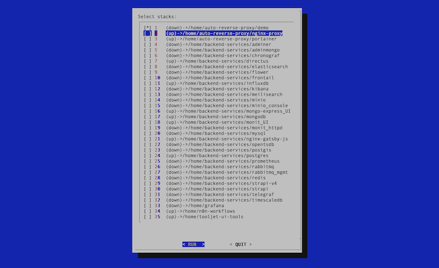
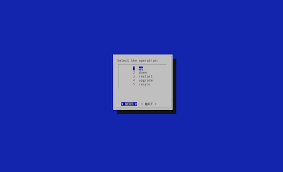

# Docker Compose Manager

manage multiple docker-compose files (stacks) in one place using an intuitive command line interface.



# Getting Started

## Install

Run the following command to install docker-compose-manager:

```shell
bash <(curl -sSL https://raw.githubusercontent.com/naskio/docker-compose-manager/main/install.sh)
```

Alternatively, you can specify a different version:

```shell
bash <(curl -sSL https://raw.githubusercontent.com/naskio/docker-compose-manager/main/install.sh) multi
bash <(curl -sSL https://raw.githubusercontent.com/naskio/docker-compose-manager/main/install.sh) arrow-keys-v2
bash <(curl -sSL https://raw.githubusercontent.com/naskio/docker-compose-manager/main/install.sh) arrow-keys
bash <(curl -sSL https://raw.githubusercontent.com/naskio/docker-compose-manager/main/install.sh) ps3
bash <(curl -sSL https://raw.githubusercontent.com/naskio/docker-compose-manager/main/install.sh) dialog
```

Available versions:

- ```arrow-keys```: Run one command on one stack, use arrow keys for navigation.
- ```arrow-keys-v2```: Run one command on one stack, use arrow keys for navigation - version 2.
- ```ps3```: Run one command on one stack, use ps3 for selection.
- ```dialog```: Run one command on one stack, use dialog for selection.
- ```multi```: run one-command on multiple docker-compose files (stacks), use dialog for selection. (default version)

## Check

Check if docker-compose-manager has been installed correctly:

```shell
which dcm
```

## Usage

Inside the folder where you want to manage docker-compose files, run the following commands:

```shell
dcm
```

### Available commands

- ```up```: start all services in the stack.
- ```down```: stop all services in the stack.
- ```restart```: restart all services in the stack (`up` then `down`).
- ```resync```: fetch the latest code from GitHub then restart all services in the stack (`down`, `git pull` then `up`).
- ```upgrade```: upgrade images of all services in the stack (`down`, `pull` then `up`).



### Dialog Usage

Use `arrow keys` and `space` to navigate and select from the list, and `enter` to validate.

## Uninstall

Run the following command to uninstall docker-compose-manager:

```shell
bash <(curl -sSL https://raw.githubusercontent.com/naskio/docker-compose-manager/main/uninstall.sh)
```

# Contributing

[Pull requests](https://github.com/naskio/docker-compose-manager/pulls) are welcome! For any bug reports, please create
an [issue](https://github.com/naskio/docker-compose-manager/issues).

Start by reading the [contributor guideline](CONTRIBUTING.md).

# License

[License](LICENSE)